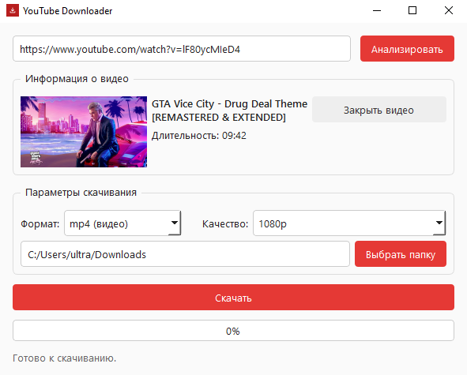
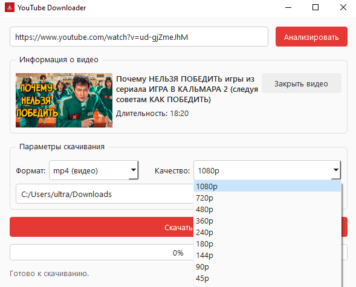
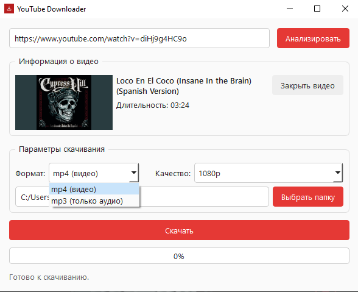
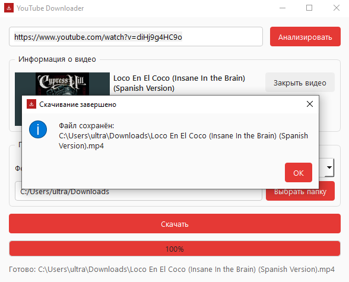

# YouTube Downloader (Windows, Python + PySide6 + yt-dlp)
Навайбкоженное приложение для скачивания видео/аудио с YouTube по ссылке, с выбором качества и формата (mp4/mp3)

## Скриншоты приложения





## Скачать готовое приложение (.exe)

Если вы не разработчик и просто хотите запустить программу — не нужно
устанавливать Python и собирать проект самостоятельно:

1. Перейдите в раздел релизы этого репозитория;
2. Скачайте последнюю версию `YouTubeDownloader.exe`;
3. Запустите `YouTubeDownloader.exe`

## Структура проекта

```
yt_downloader/
├── main.py                 # точка входа
├── core/
│   ├── analyzer.py         # получение информации о видео (yt-dlp, без скачивания)
│   ├── downloader.py       # скачивание/обрезка/конвертация (yt-dlp + ffmpeg)
│   ├── workers.py          # QThread-обёртки, чтобы UI не подвисал
│   ├── settings.py         # сохранение настроек (QSettings: папка, тема, формат)
│   └── exceptions.py       # типизированные ошибки для UI
├── ui/
│   └── main_window.py      # единственный экран интерфейса
├── resources/
│   └── app.ico             # иконка приложения (добавьте свою)
├── requirements.txt
├── build.spec              # конфигурация PyInstaller
└── installer.iss           # скрипт Inno Setup для .exe-установщика
```

## Почему такой стек

- **Python + PySide6** выбран вместо Electron: нативная интеграция с `yt-dlp`
  (тоже Python) без межпроцессного обмена, меньший размер итогового .exe,
  более простая сборка одним PyInstaller.
- **yt-dlp** — для получения метаданных и скачивания.
- **ffmpeg** — нужен yt-dlp для слияния видео+аудио, конвертации в mp3
  и точной обрезки по таймкоду.

## 1. Запуск в режиме разработки

```bash
python -m venv venv
venv\Scripts\activate          # Windows
pip install -r requirements.txt
```

Скачайте `ffmpeg.exe` (например с https://www.gyan.dev/ffmpeg/builds/)
и либо добавьте его в PATH, либо положите `ffmpeg.exe` в корень проекта —
yt-dlp найдёт его автоматически, если он в той же папке, что и main.py,
либо в PATH.

Запуск:

```bash
python main.py
```

## 2. Сборка в один .exe (PyInstaller)

```bash
pip install pyinstaller
pyinstaller build.spec
```

Готовый файл появится в `dist\YouTubeDownloader.exe`.

Перед сборкой:
- поместите свою иконку в `resources/app.ico` (любой .ico 256x256);
- если хотите, чтобы `ffmpeg.exe` был встроен в exe, добавьте его в
  `datas=[('ffmpeg.exe', '.')]` в `build.spec` — тогда отдельно класть
  ffmpeg рядом с программой не нужно.

## Обработка ошибок

- **Неверная ссылка** — проверяется регулярным выражением перед запросом
  к YouTube (`core/analyzer.py: validate_url`), показывается понятное
  сообщение, сетевой запрос не выполняется.
- **Видео недоступно** (приватное/удалено/гео-блок) — отдельное исключение
  `VideoUnavailableError`, текст подсказывает возможную причину.
- **Нет соединения** — `NetworkError`, пользователю предлагается проверить сеть.
- **Неверный таймкод** — проверяется перед запуском скачивания
  (`DownloadTask.validate`), без обращения к сети.

Все ошибки всплывают в UI как `QMessageBox.critical`, приложение
остаётся в рабочем состоянии, поток скачивания не зависает.

## Юридическое примечание

Скачивание контента с YouTube должно соответствовать Условиям
использования YouTube и законам об авторском праве в вашей юрисдикции.
Инструмент предназначен для скачивания материалов, на которые у вас
есть права (собственные видео, контент с открытой лицензией и т.п.).
